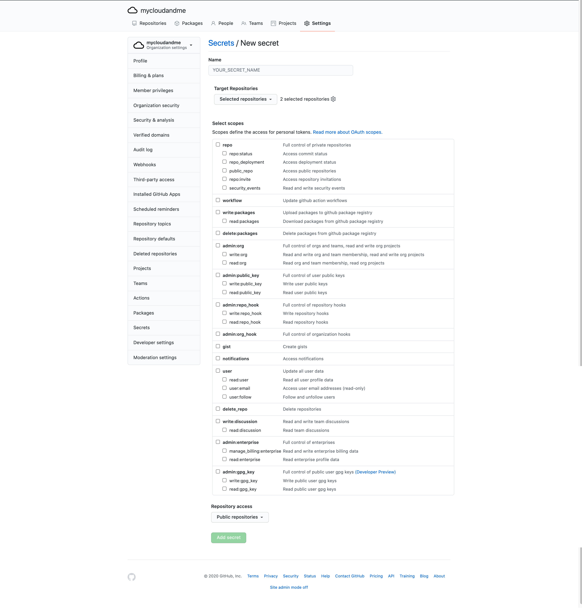

# Secret Garden

## Problem statement

Actions tokens are scoped to a single repository, and have a fixed set of permissions.
If customers want additional control, GitHub officially(?) recommends creating throwaway User accounts to host PATs.
Customers should have more control over GitHub tokens provided to Actions than this.

### Bad mockups

Configure like another Actions secret value, but define GitHub scopes instead of providing a raw value:

Organizations can add additional repos to this scope, similar to Dependabot's "Private Git Dependencies":

(Bonus points awarded if you can identify the controls I hacked in GIMP to make the above)

## Solutions

- Wait for GitHub to build this - https://github.com/github/c2c-actions/issues/1527
- Build tooling for fast user switching and PAT maintenance
    - AFAICT the ability to mint PATs via API may be going away? https://developer.github.com/changes/2020-02-14-deprecating-oauth-auth-endpoint/
    - This is would be a MAU-multiplier, gaming the core4
- Fake it til GitHub makes it...
    - Scheduled Action mints tokens as a GitHub App, stores them via the secrets API
    - Actions use them like other secrets
    - GitHub feature swaps out with the Scheduled Action perfectly.
